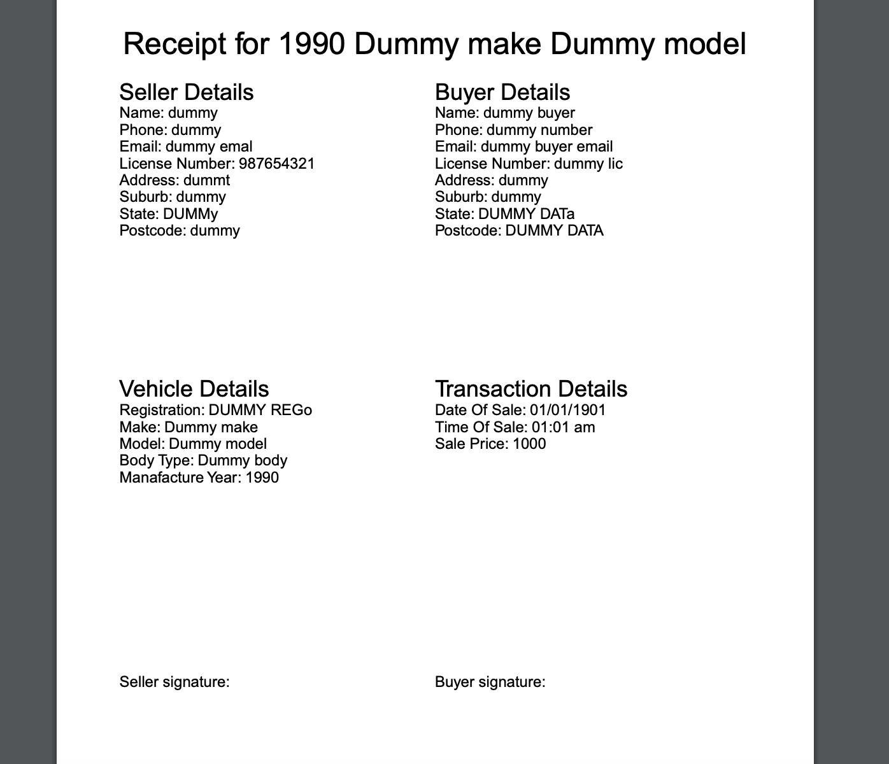

# Car Receipt App

A simple app made using React, TypeScript and Mobx that allows a user to enter details of a car transaction - and generates a receipt from it. Receipt is based off the example one given on the VicRoads website.

Main motivation behind this was to delve into the world of Mobx - happened to be at a time where I was looking for a car as well :)

Note: I did not intend to use this for legal purposes - just a small little side project.

Example receipt:
  
This project was bootstrapped with [Create React App](https://github.com/facebook/create-react-app).

## Available Scripts

In the project directory, you can run:

### `npm start`

Runs the app in the development mode.\
Open [http://localhost:3000](http://localhost:3000) to view it in the browser.

The page will reload if you make edits.\
You will also see any lint errors in the console.

### `npm test`

Launches the test runner in the interactive watch mode.\
See the section about [running tests](https://facebook.github.io/create-react-app/docs/running-tests) for more information.
